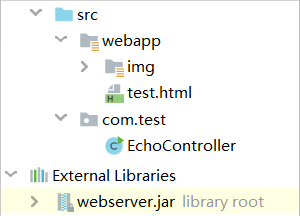
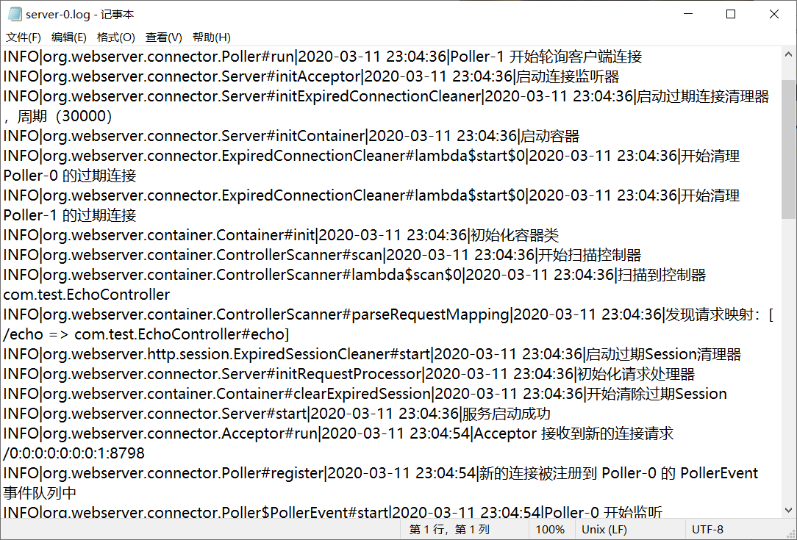
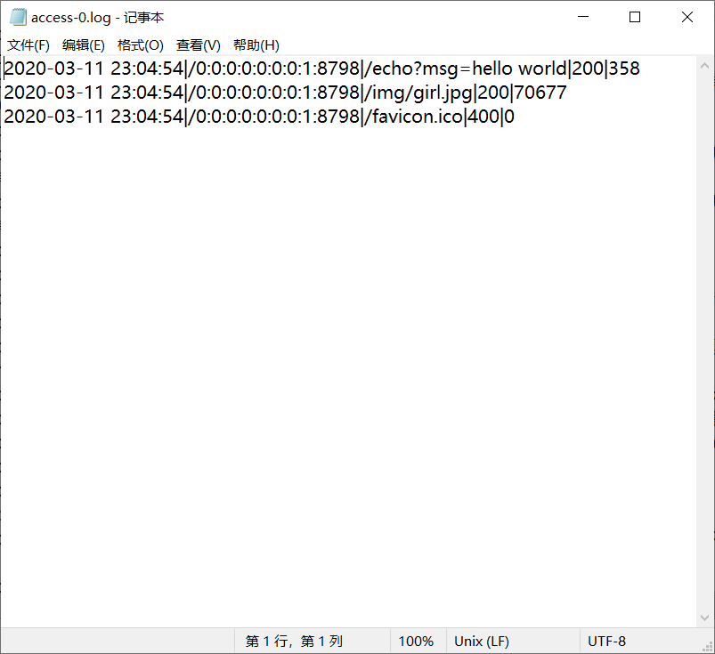

# Java 实现的一个简单的基于 NIO 的多线程Web服务器


## 实现了

- 静态、动态资源获取；

- Cookie、Session、HTTP 长连接，及 Session 和 HTTP 长连接的定时清除；

- 类似 Spring MVC 的注解式编程，如 `@RequestMapping` `@RequestParam` 等，方法中可以根据参数名从前台获取数据，可以传递对象，也支持级联属性，如：

  ```java
  // GET /page?pageSize=10&pageNum=1 HTTP/1.1
  @RequestMapping("/page")
  String page(@RequestParam(value="pageSize", defaultValue="10") Integer pageSize, Integer pageNum) {...}
  
  /**
   * POST /login HTTP/1.1
   * ...
   * user.name=admin&user.passwd=admin&user.data.val=ok
   * *******
   * User 类：String name; String passwd; Data data;
   * Data 类: String val;
   */
  @RequestMapping("/login", method = HttpMethod.POST)
  String login(User user) {...}
  ```

- 方法可以返回一个字符串表示模板路径，模板使用正则实现，仅可以从 `request` 和 `session` 域中获取属性值，如 `${request.user.id}`；

- 日志记录（使用 java.util.logging 内置日志记录器，自定义了日志格式）：服务器运行相关日志（server-n.log），HTTP 请求日志（access-n.log）。

**API 汇总：**

```
@Controller
@RequestMapping
@RequestParam
@RequestHeader
@CookieValue
HttpRequest
HttpResponse
HttpSession
Cookie
HttpMethod
```


## 类结构

- webserver.BootStrap：启动类，读取配置文件，初始化日志记录器，并启动 webserver.connector.Server 类
- webserver.connector：存放与网络连接相关的类
  - Server：初始化服务器的各个组件
  - Acceptor：监听客户端的连接请求，并将连接放入Poller中进行请求监听，守护线程
  - Poller：保存与客户端的Socket连接，监听客户端的请求，多个守护线程
  - SocketWrapper：客户端 SocketChannel 的包装器，封装了一些方法
  - RequestProcessor：请求处理器，将请求放入内部的线程池中处理
  - ExpiredConnectionCleaner：清理长时间为传输数据的Socket（HTTP长连接的定时清除）
- webserver.container：存放容器类及相关的一些类和注解
  - annotation：存放注解
  - Container：容器类，保存 HttpSession 和 控制器中的响应方法，包含HttpSession的创建获取销毁的方法，对传过来的 HttpRequest 找到对应的响应方法执行 
  - TargetMethod：对控制器中的响应方法的封装
  - ControllerScanner：扫描 classpath 下被 `@Controller` 注解标记的控制器类
- webserver.http：存放与HTTP相关的类
  - request.HttpRequest
  - request.HttpRequestParser：从请求数据中解析出 HttpRequest
  - response.HttpResponse
  - response.HttpStatus
  - session.HttpSession
  - session.ExpiredSessionCleaner：清理过期的HttpSessin
  - Cookie
  - HttpMethod
- webserver.constant：存放一些常量
  - ...
- webserver.exception：自定义异常
  - ...
- webserver.util：工具类
  - ...


## 使用方法

导入 jar 包（见 release）即可使用相关注解，还需要在 classpath 下创建一个 webapp 目录，表示静态 web 资源的根路径。然后在主类的 `main` 方法中调用 `BootStrap.run()`，由于扫描控制器是通过遍历目录实现的，所以项目不支持打包，必须以 class 文件的形式发布。参数配置需要在 classpath 中提供一个 server-config.properties 配置文件即可，包含如下配置项：

```properties
# 服务器端口
PORT=80
# 存储日志文件的路径
LOG_FILE_STORAGE_PATH=E:\\
# 连接过期时间，单位毫秒
CONNECTION_EXPIRY_TIME=30000
# 清理过期连接的周期，单位毫秒
CONNECTION_CLEANING_CYCLE=30000
# Session 过期时间，单位毫秒
SESSION_EXPIRY_TIME=30000
# 清理过期 Session 的周期，单位毫秒
SESSION_CLEANING_CYCLE=30000
# 监听客户端读事件的线程数目
POLLER_THREAD_COUNT=2
# 处理具体请求的线程池的大小
REQUEST_PROCESSOR_THREAD_COUNT=4
```


## 演示

- 项目结构



- EchoController.java

  ```java
  package com.test;
  
  // 导包省略...
  
  @Controller // 只有被 @Controller 标记的才会被认为是控制器
              // 支持在类上使用 @RequestMapping 注解，
  public class EchoController {
  
      // 线程安全
      private static final DateTimeFormatter formatter = DateTimeFormatter.ofPattern("yyyy-MM-dd HH:mm:ss");
  
      @RequestMapping("/echo") // 映射到 "/echo"
      public String echo(HttpRequest request, @RequestParam(value = "msg", defaultValue = "输入为空") String msg) {
  
          LocalDateTime localDateTime = LocalDateTime.ofEpochSecond(request.getSession().getLastAccessedTime() / 1000, 0, ZoneOffset.ofHours(8));
          request.setAttribute("lastAccessedTime", localDateTime.format(formatter));
          request.setAttribute("msg", msg);
          return "test.html"; // 要渲染的的模板路径（classpath:webapp/test.html）
      }
  
      public static void main(String[] args) {
          BootStrap.run();
      }
  }
  ```

- test.html

  ```html
  <!DOCTYPE>
  <html lang="en">
      <head>
          <title>Test</title>
      </head>
      <body>
          <p>Echo: ${request.msg}</p>
          <p>Last Accessed Time: ${request.lastAccessedTime}</p>
          <p></p>
      </body>
  </html>
  ```

- 效果

  

- 日志

  

  

  

